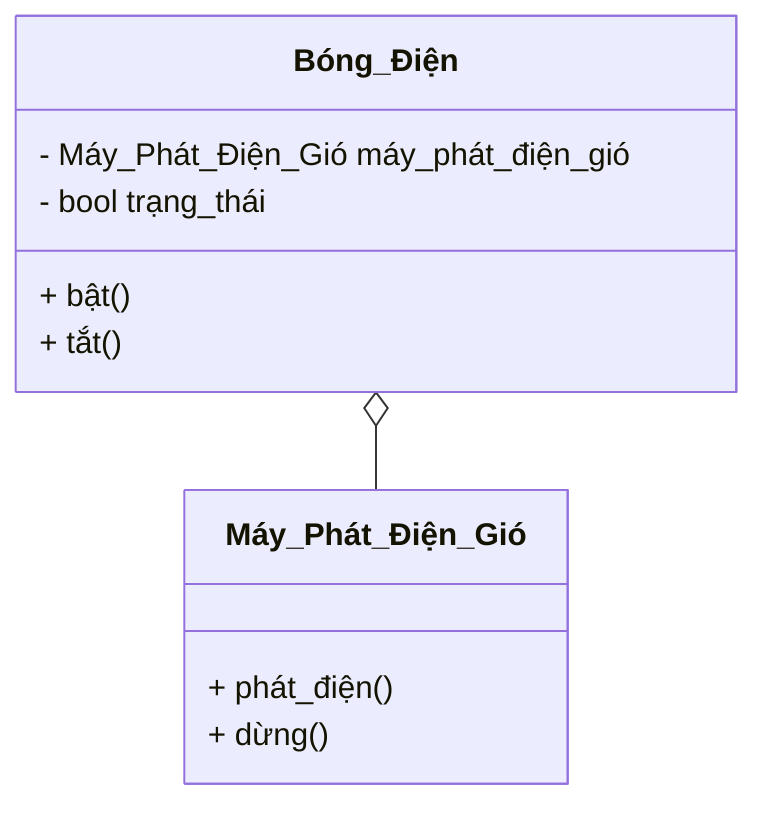
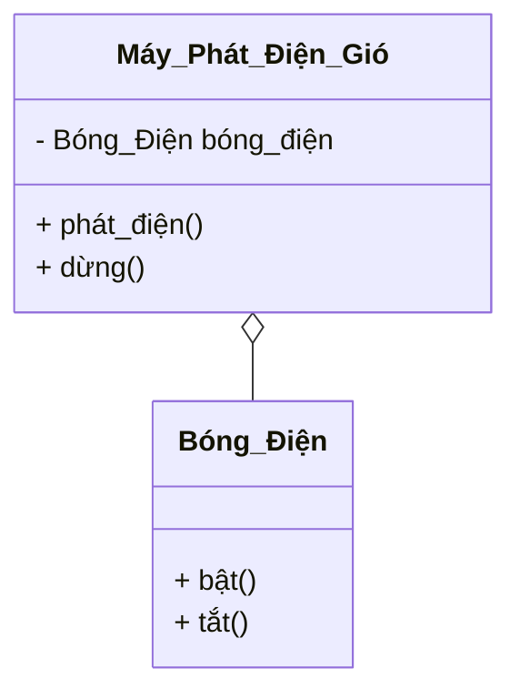

# Bài toán

**IMAGE** by [NDepend.com](https://blog.ndepend.com/solid-design-the-dependency-inversion-principle-dip/)

> ## Bài toán: Bóng điện sẽ gắn trực tiếp vào nguồn điện?

### TH1 - Bóng điện có bao gồm máy phát điện luôn.

### TH2 - Máy phát điện bao gồm bóng điện

> ## Câu trả lời: ??

<!-- **IMAGE 1** by [DevIQ.com](https://deviq.com/principles/dependency-inversion-principle)

 -->