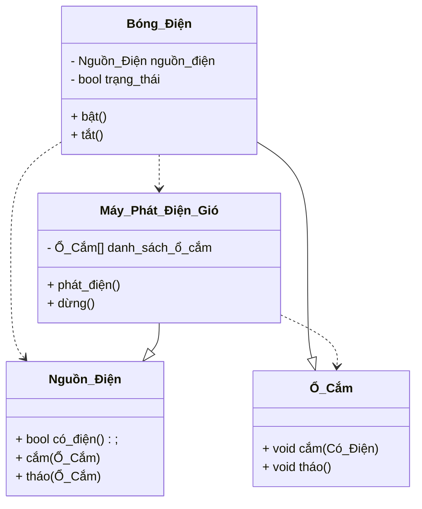

```mermaid
classDiagram
    Bóng_Điện ..> Nguồn_Điện
    Bóng_Điện ..> Máy_Phát_Điện_Gió
    Bóng_Điện --|> Ổ_Cắm
    Máy_Phát_Điện_Gió ..> Ổ_Cắm
    Máy_Phát_Điện_Gió --|> Nguồn_Điện

    class Bóng_Điện {
        - Nguồn_Điện nguồn_điện
        - bool trạng_thái

        + bật()
        + tắt()
    }

    class Máy_Phát_Điện_Gió {
        - Ổ_Cắm[] danh_sách_ổ_cắm
        + phát_điện()
        + dừng()
    }

    class Ổ_Cắm {
        + void cắm(Có_Điện)
        + void tháo()
    }

    class Nguồn_Điện {
        + bool có_điện();
        + cắm (Ổ_Cắm)
        + tháo (Ổ_Cắm)
    }
```