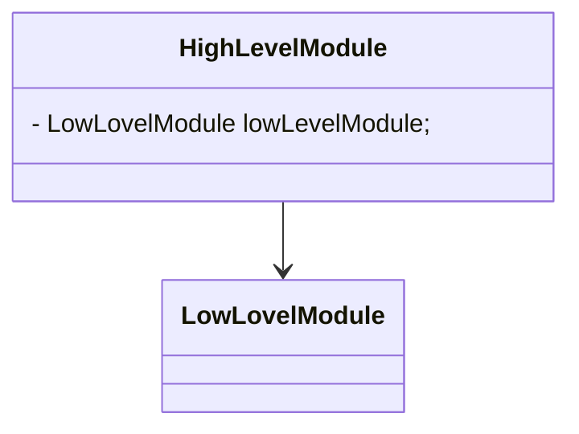
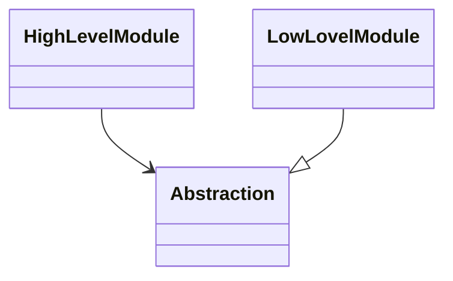
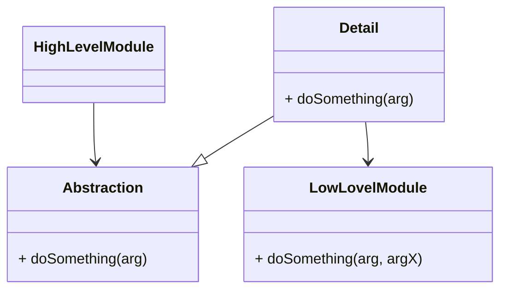

# DIP & IoC Talk

A breif about DIP & IoC including theory and examples.

<div style="margin-top: 6em; font-size: 16pt;">
slides using Markdown with <a href="https://marketplace.visualstudio.com/items?itemName=evilz.vscode-reveal">vscode-reveal</a>
</div>

---

## Basic Concepts

- Dependency is a class and/or interface required by another component to function
- High Level Module is the one will **require** the dependency
- Low Level Module is the one will **fulfill** the dependency




---

## DIP

> The 5th principle in SOLID


<!-- Ref: https://embeddedartistry.com/fieldmanual-terms/dependency-inversion-principle/ -->
<!-- Ref: https://deviq.com/principles/dependency-inversion-principle -->
<!-- Ref: https://blog.ndepend.com/solid-design-the-dependency-inversion-principle-dip/ -->
<!-- Ref: https://martinfowler.com/articles/dipInTheWild.html -->

--

## DIP's characteristics - 1/2

- **High level modules** should not depend on **low level modules**; both should depend on **abstractions**.



--

## DIP's characteristics - 1/2

```csharp
// c#
class HighLevelModule {
    private LowLevelModule lowLevelModule;

    public HighLevelModule() {
        lowLevelModule = new LowLevelModule();
    }
}
```

=>

```csharp
// c#
class HighLevelModule {
    private Abstraction abstraction;

    public HighLevelModule(Abstraction abstraction) {
        this.abstraction = abstraction;
    }
}

class LowLevelModule : Abstraction {

}
```

- Is this the only way?

--

## DIP's characteristics - 2/2

- `Abstractions` should not depend on `details`.  Details should depend upon abstractions



--

## DIP's characteristics - 2/2

```csharp
// c#
class HighLevelModule {
    private Abstraction abstraction;

    public HighLevelModule(Abstraction abstraction) {
        this.abstraction = abstraction;
    }
}
abstract class Abstraction {
    public abstract void DoSomething(ArgType arg);
}
class LowLevelModule : Abstraction {
    public override void DoSomething(AnotherArgType arg) {}
}
```

- Does it looks familiar to you?

--

## DIP's characteristics - 2/2

- Is this the way to go?

```csharp
// c#
class HighLevelModule {
    private Abstraction abstraction;

    public HighLevelModule(Abstraction abstraction) {
        this.abstraction = abstraction;
    }
}
abstract class Abstraction {
    public abstract void DoSomething(AnotherArgType arg);
}
class LowLevelModule : Abstraction {
    public override void DoSomething(AnotherArgType arg) {}
}
```

--

## DIP's characteristics - 2/2

```csharp
class HighLevelModule {
    // thousand lines of code...
}
abstract class Abstraction {
    public abstract void DoSomething(ArgType arg);
}
class Detail : Abstraction {
    private LowLevelModule llm;
    public override void DoSomething(ArgType arg) {
        llm.DoSomething(CreateAnotherArgType(arg));
    }
}
class LowLevelModule {
    public override void DoSomething(AnotherArgType arg) {}
}
```

> A mediator should always be the way to go!!!!

---

# Inversion of Control

--

In software engineering, **Inversion of Control** (IoC) is a **design pattern** in which custom-written portions of a computer program **receive the flow of control** from a **generic** framework. 

--wikipedia--

--

```csharp
// c# 
class HighLevelModule {
    private LowLevelModule lowLevelModule;
    public HighLevelModule() {
        // I knows how to create my dependency
        lowLevelModule = new LowLevelModule();
    }
}
```
=>
```csharp
// c#
class HighLevelModule {
    private Abstraction abstraction;
    public HighLevelModule(Abstraction abstraction) {
        // I know my dependency will be given (injected)
        // by the **generic** framework
        this.abstraction = abstraction;
    }
}
class LowLevelModule : Abstraction {

}
```

---

# IoC Techniques

- **Service Locator**
- **Dependency Injection**
    - **Constructor Injection**
- Several others

--[wikipedia](https://en.wikipedia.org/wiki/Inversion_of_control#Implementation_techniques)--

<!-- Ref: https://en.wikipedia.org/wiki/Inversion_of_control#Implementation_techniques -->

---

## Service Locator

- **HighLevelModule** only need to know the locator and the abstractions. It will find right implemtations.


--

## Service Locator Snippet

```csharp
class HighLevelModule {
    HighLevelModule() {
        this.abs1 = ServiceLocator.Get<Abs1>();
    }
}
class Impl1 : Abs1 {
    Impl1() {
        this.abs2 = ServiceLocator.Get<Abs2>();
    }
}
class Impl2 : Abs2 {}
// At the time of app boostrap
ServiceLocator.Register<Abs1>(() => new Impl1());
ServiceLocator.Register<Abs2>(() => new Impl2());
```

--

## Service Locator Pros & Cons

| + | - |
| ---- | ---- |
| + Easy to implement | - A new dependency introduced |
| + Easy to apply for legacy system | - Have to register every dependency (**automate-able**) |
| + Easy to do UTs | - Hides dependencies |
| + Easy to extend | - Hard to maintain  |

<!-- Ref: https://blog.ploeh.dk/2010/02/03/ServiceLocatorisanAnti-Pattern/ -->
<!-- Ref: https://www.geeksforgeeks.org/service-locator-pattern/ -->

--

### SERVICE LOCATOR DEMO

---

## Dependency Injection (DI)

- HighLevelModule only depends on the abstractions. The implementations will be injected by the DI container


<!-- Ref: https://www.dotnettricks.com/learn/dependencyinjection/understanding-inversion-of-control-dependency-injection-and-service-locator -->

--

## DI Snippet

```csharp
class HighLevelModule {
    HighLevelModule(Abs1 abs1) {//Constructor injection
        this.abs1 = abs1;
    }
}
class Impl1 : Abs1 { }
// At the time of app boostrap
DIContainer.Register<Abs1>(() => new Impl1());
DIContainer.Register<HighLevelModule>(
    () => new HighLevelModule(
        DIContainer.Resolve<Abs1>()
    ));

var hlm = DIContainer.Resolve<HighLevelModule>();
```

--

## DI Pros & Cons

| + | - |
| ---- | ---- |
| + All from Service Locator | - Not easy for newbie to understand |
| + Easy to maintain |  - Have to register every dependency (**automate-able**) |
| + Easy to get-started | |
| + Eliminate most of Service locator's cons |  |

<!-- Ref: https://deviq.com/practices/dependency-injection -->

--

### DI DEMO

---

# Q&A

--

## Thank you
