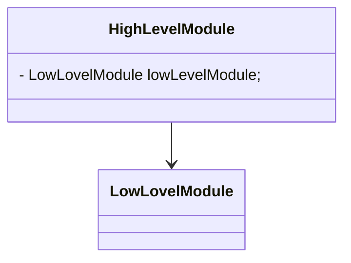
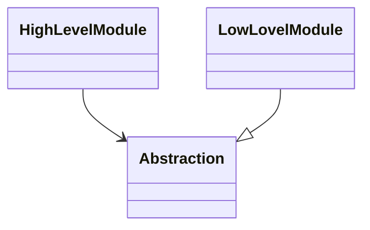
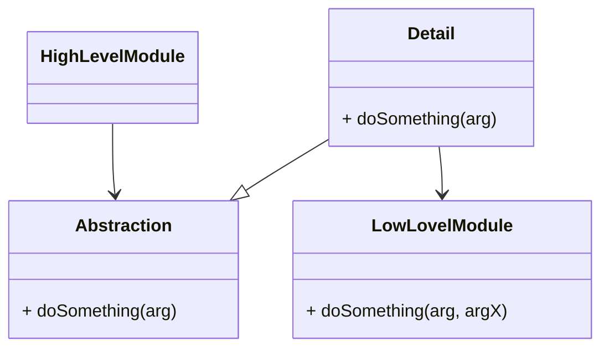

# DIP & IoC Talk

The talk about DIP & IoC including theory and examples.


<div style="margin-top: 6em; font-size: 16pt;">
slides using Markdown with <a href="https://marketplace.visualstudio.com/items?itemName=evilz.vscode-reveal">vscode-reveal</a>
</div>

---

## Basic Concepts

- Dependency is a class and/or interface required by another component to function

- High Level Module is the one will **require** the dependency
- Low Level Module is the one will **fulfill** the dependency




---

## DIP

> The 5th principle in SOLID


<!-- Ref: https://embeddedartistry.com/fieldmanual-terms/dependency-inversion-principle/ -->
<!-- Ref: https://deviq.com/principles/dependency-inversion-principle -->
<!-- Ref: https://blog.ndepend.com/solid-design-the-dependency-inversion-principle-dip/ -->

--

## DIP's characteristics - 1/2

- **High level modules** should not depend on **low level modules**; both should depend on **abstractions**.



--

## DIP's characteristics - 1/2

```csharp
// c#
class HighLevelModule {
    private LowLevelModule lowLevelModule;

    public HighLevelModule() {
        lowLevelModule = new LowLevelModule();
    }
}
```

=>

```csharp
// c#
class HighLevelModule {
    private Abstraction abstraction;

    public HighLevelModule(Abstraction abstraction) {
        this.abstraction = abstraction;
    }
}

class LowLevelModule : Abstraction {

}
```

- Is this the only way?

--

## DIP's characteristics - 2/2

- `Abstractions` should not depend on `details`.  Details should depend upon abstractions



--

## DIP's characteristics - 2/2

```csharp
// c#
class HighLevelModule {
    private Abstraction abstraction;

    public HighLevelModule(Abstraction abstraction) {
        this.abstraction = abstraction;
    }
}
abstract class Abstraction {
    public abstract void DoSomething(ArgType arg);
}
class LowLevelModule : Abstraction {
    public override void DoSomething(AnotherArgType arg) {}
}
```

- Does it looks familiar to you?

--

## DIP's characteristics - 2/2

- Is this the way to go?

```csharp
// c#
class HighLevelModule {
    private Abstraction abstraction;

    public HighLevelModule(Abstraction abstraction) {
        this.abstraction = abstraction;
    }
}
abstract class Abstraction {
    public abstract void DoSomething(AnotherArgType arg);
}
class LowLevelModule : Abstraction {
    public override void DoSomething(AnotherArgType arg) {}
}
```

--

## DIP's characteristics - 2/2

```csharp
class HighLevelModule {
    // thousand lines of code...
}
abstract class Abstraction {
    public abstract void DoSomething(ArgType arg);
}
class Detail : Abstraction {
    private LowLevelModule llm;
    public override void DoSomething(ArgType arg) {
        llm.DoSomething(CreateAnotherArgType(arg));
    }
}
class LowLevelModule {
    public override void DoSomething(AnotherArgType arg) {}
}
```

> A mediator should always be the way to go!!!!

