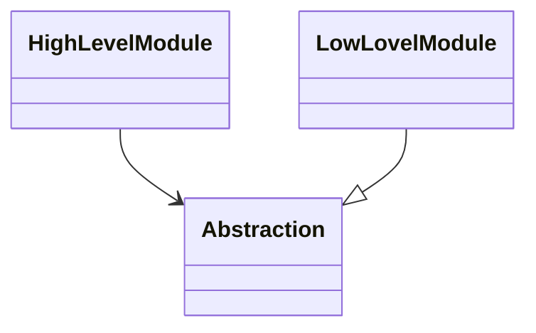
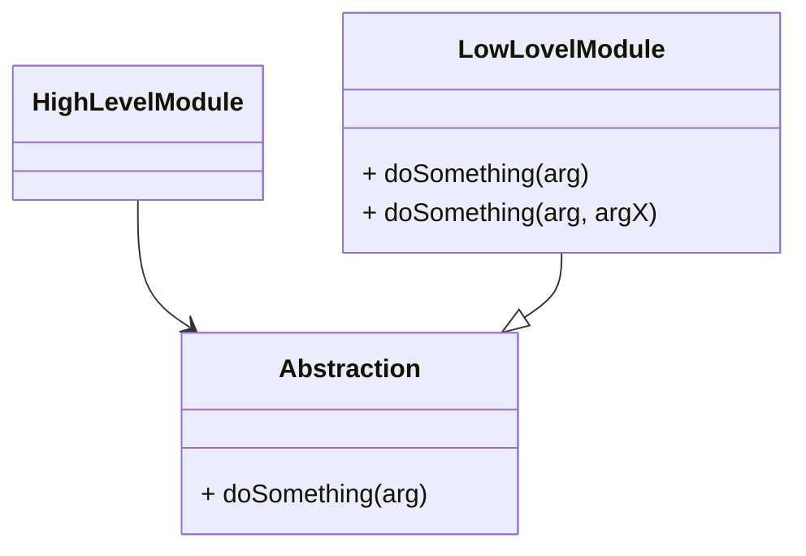

# DIP & IoC Talk

The talk about DIP & IoC including theory and examples.

slides using Markdown with <a href="https://marketplace.visualstudio.com/items?itemName=evilz.vscode-reveal">vscode-reveal</a>

---

## DIP

> The 5th principle in SOLID

--

## DIP's characteristics - 1/2

- **High level modules** should not depend on **low level modules**; both should depend on **abstractions**.

--

## DIP's characteristics - 2/2

- `Abstractions` should not depend on `details`.  Details should depend upon abstractions

